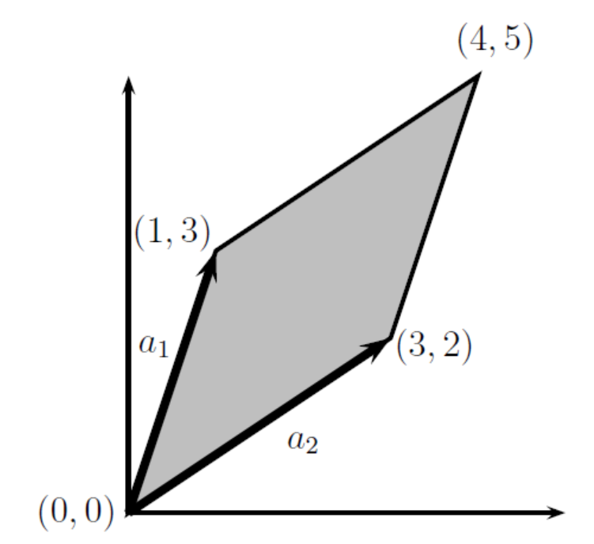

> 本文是斯坦福大学CS 229机器学习课程的基础材料，[原始文件下载](http://cs229.stanford.edu/summer2019/cs229-linalg.pdf)

> 翻译：[黄海广](https://github.com/fengdu78)
> 备注：请关注[github](https://github.com/fengdu78/Data-Science-Notes/tree/master/0.math)的更新，近期将更新完。

# CS 229 机器学习课程复习材料

[TOC]
## 一、线性代数复习和参考

### 1.  基础概念和符号

线性代数提供了一种紧凑地表示和操作线性方程组的方法。 例如，以下方程组：
$$
4x_1 − 5x_2 = −13
$$
$$
−2x_1 + 3x_2 = 9
$$

这是两个方程和两个变量，正如你从高中代数中所知，你可以找到$x_1$和$x_2$的唯一解（除非方程以某种方式退化，例如，如果第二个方程只是第一个的倍数，但在上面的情况下，实际上只有一个唯一解）。 在矩阵表示法中，我们可以更紧凑地表达：

$$
Ax= b
$$

$$
\text { with } A=\left[\begin{array}{cc}{4} & {-5} \\ {-2} & {3}\end{array}\right], b=\left[\begin{array}{c}{13} \\ {-9}\end{array}\right]
$$

我们可以看到，这种形式的线性方程有许多优点（比如明显地节省空间）。

#### 1.1 基本符号

我们使用以下符号：

-   $A \in \mathbb{R}^{m \times n}$，表示$A$为由实数组成具有$m$行和$n$列的矩阵。

-   $x \in \mathbb{R}^{ n}$，表示具有$n$个元素的向量。 通常，向量$x$将表示列向量: 即，具有$n$行和$1$列的矩阵。 如果我们想要明确地表示行向量: 具有$1$行和$n$列的矩阵 - 我们通常写$x^T$（这里$x^T$$x$的转置）。

-   $x_i$表示向量$x$的第$i$个元素

$$
x=\left[\begin{array}{c}{x_{1}} \\ {x_{2}} \\ {\vdots} \\ {x_{n}}\end{array}\right]
$$

-   我们使用符号$a_{ij}$（或$A_{ij}$,$A_{i,j}$Aij，Ai，j等）来表示第$i$行和第$j$列中的$A$的元素：

$$
A=\left[\begin{array}{cccc}{a_{11}} & {a_{12}} & {\cdots} & {a_{1 n}} \\ {a_{21}} & {a_{22}} & {\cdots} & {a_{2 n}} \\ {\vdots} & {\vdots} & {\ddots} & {\vdots} \\ {a_{m 1}} & {a_{m 2}} & {\cdots} & {a_{m n}}\end{array}\right]
$$

-   我们用$a^j$或者$A_{:,j}$表示矩阵$A$的第$j$列：

$$
A=\left[\begin{array}{llll}{ |} & { |} & {} & { |} \\ {a^{1}} & {a^{2}} & {\cdots} & {a^{n}} \\ { |} & { |} & {} & { |}\end{array}\right]
$$

-   我们用$a^T$或者$A_{i,:}$表示矩阵$A$的第$i$行：
$$
A=\left[\begin{array}{c}{-a_{1}^{T}-} \\ {-a_{2}^{T}-} \\ {\vdots} \\ {-a_{m}^{T}-}\end{array}\right]
$$

-   在许多情况下，将矩阵视为列向量或行向量的集合非常重要且方便。 通常，在向量而不是标量上操作在数学上（和概念上）更清晰。用于矩阵的列或行的表示并没有通用约定，因此只要明确定义了符号。

#### 2.矩阵乘法

两个矩阵相乘，其中 $A \in \mathbb{R}^{m \times n}$  and $B \in \mathbb{R}^{n \times p}$ ，则：

$$
C = AB \in \mathbb{R}^{m \times p}
$$

其中：

$$
C_{i j}=\sum_{k=1}^{n} A_{i k} B_{k j}
$$

请注意，为了使矩阵乘积存在，$A$中的列数必须等于$B$中的行数。有很多方法可以查看矩阵乘法，我们将从检查一些特殊情况开始。

##### 2.1 向量-向量乘法

给定两个向量$x, y \in \mathbb{R}^{n}$,$x^T y$通常称为**向量内积**或者**点积**，结果是个**实数**。

$$
x^{T} y \in \mathbb{R}=\left[\begin{array}{llll}{x_{1}} & {x_{2}} & {\cdots} & {x_{n}}\end{array}\right]\left[\begin{array}{c}{y_{1}} \\ {y_{2}} \\ {\vdots} \\ {y_{n}}\end{array}\right]=\sum_{i=1}^{n} x_{i} y_{i}
$$

注意：$x^T y = y^Tx$始终成立。

给定向量$x \in \mathbb{R}^{m}$, $y \in \mathbb{R}^{n}$ (他们的尺寸是否相同都没关系)，$xy^T \in \mathbb{R}^{m \times n}$叫做**向量外积 ** , 当 $(xy^T)_{ij} = x_iy_j$ 的时候，它是一个矩阵。

$$
x y^{T} \in \mathbb{R}^{m \times n}=\left[\begin{array}{c}{x_{1}} \\ {x_{2}} \\ {\vdots} \\ {x_{m}}\end{array}\right]\left[\begin{array}{llll}{y_{1}} & {y_{2}} & {\cdots} & {y_{n}}\end{array}\right]=\left[\begin{array}{cccc}{x_{1} y_{1}} & {x_{1} y_{2}} & {\cdots} & {x_{1} y_{n}} \\ {x_{2} y_{1}} & {x_{2} y_{2}} & {\cdots} & {x_{2} y_{n}} \\ {\vdots} & {\vdots} & {\ddots} & {\vdots} \\ {x_{m} y_{1}} & {x_{m} y_{2}} & {\cdots} & {x_{m} y_{n}}\end{array}\right]
$$
举一个外积如何使用的一个例子，让$1\in R^{n}$表示一个$n$维向量，其元素都等于1，此外，考虑矩阵$A \in R^{m \times n}$，其列全部等于某个向量$x \in R^{m}$。 我们可以使用外积紧凑地表示矩阵$A$:

$$
A=\left[\begin{array}{llll}{ |} & { |} & {} & { |} \\ {x} & {x} & {\cdots} & {x} \\ { |} & { |} & {} & { |}\end{array}\right]=\left[\begin{array}{cccc}{x_{1}} & {x_{1}} & {\cdots} & {x_{1}} \\ {x_{2}} & {x_{2}} & {\cdots} & {x_{2}} \\ {\vdots} & {\vdots} & {\ddots} & {\vdots} \\ {x_{m}} & {x_{m}} & {\cdots} & {x_{m}}\end{array}\right]=\left[\begin{array}{c}{x_{1}} \\ {x_{2}} \\ {\vdots} \\ {x_{m}}\end{array}\right]\left[\begin{array}{lll}{1} & {1} & {\cdots} & {1}\end{array}\right]=x \mathbf{1}^{T}
$$
##### 2.2 矩阵-向量乘法

给定矩阵 $A \in \mathbb{R}^{m \times n}$，向量 $x \in  \mathbb{R}^{n}$ , 它们的积是一个向量 $y = Ax \in R^{m}$。 有几种方法可以查看矩阵向量乘法，我们将依次查看它们中的每一种。

如果我们按行写$A$，那么我们可以表示$Ax$为：

$$
y=A x=\left[\begin{array}{ccc}{-} & {a_{1}^{T}} & {-} \\ {-} & {a_{2}^{T}} & {-} \\ {} & {\vdots} & {} \\ {-} & {a_{m}^{T}} & {-}\end{array}\right] x=\left[\begin{array}{c}{a_{1}^{T} x} \\ {a_{2}^{T} x} \\ {\vdots} \\ {a_{m}^{T} x}\end{array}\right]
$$

换句话说，第$i$个$y$是$A$的第$i$行和$x$的内积，即：$y_i = y_{i}=a_{i}^{T} x$。

同样的， 可以把 *A* 写成列的方式，则公式如下：,

$$
y=A x=\left[\begin{array}{cccc}{ |} & { |} & {} & { |} \\ {a^{1}} & {a^{2}} & {\cdots} & {a^{n}} \\ { |} & { |} & {} & { |}\end{array}\right]\left[\begin{array}{c}{x_{1}} \\ {x_{2}} \\ {\vdots} \\ {x_{n}}\end{array}\right]=\left[\begin{array}{c}{ } \\ {a^{1}{ } \\ }\end{array}\right] x_{1}+\left[\begin{array}{c}{ } \\ {a^{2}{ } \\ }\end{array}\right] x_{2}+\left[\begin{array}{c}{ } \\ {a^{n}{ } \\ }\end{array}\right] x_{n}
$$

换句话说，$y$是$A$的列的线性组合，其中线性组合的系数由$x$的条目给出。

到目前为止，我们一直在右侧乘以列向量，但也可以在左侧乘以行向量。 这是写的，$y^T = x^TA$ 表示$A \in \mathbb{R}^{m \times n}$，$x \in \mathbb{R}^{m}$，$y \in \mathbb{R}^{n}$。 和以前一样，我们可以用两种可行的方式表达$y^T$，这取决于我们是否根据行或列表达$A$.

第一种情况，我们把$A$用列表示：

$$
y^{T}=x^{T} A=x^{T}\left[\begin{array}{cccc}{ |} & { |} & {} & { |} \\ {a^{1}} & {a^{2}} & {\cdots} & {a^{n}} \\ { |} & { |} & {} & { |}\end{array}\right]=\left[\begin{array}{cccc}{x^{T} a^{1}} & {x^{T} a^{2}} & {\dots} & {x^{T} a^{n}}\end{array}\right]
$$

这表明$y^T$的第$i$个条目等于$x$和$A$的第$i$列的内积。

最后，根据行表示$A$，我们得到了向量-矩阵乘积的最终表示:

$$
y^T=x^TA
=\left[\begin{array}{llll}{x_{1}} & {x_{2}} & {\cdots} & {x_{n}}\end{array}\right]\left[\begin{array}{c}{-a_{1}^{T}-} \\ {-a_{2}^{T}-} \\ {\vdots} \\ {-a_{m}^{T}-}\end{array}\right]

=x_{1}\left[-a_{1}^{T}-\right]+x_{2}\left[-a_{2}^{T}-\right]+\ldots+x_{n}\left[-a_{n}^{T}-\right]
$$
所以我们看到$y^T$是$A$的行的线性组合，其中线性组合的系数由$x$的条目给出。

##### 2.3 矩阵-矩阵乘法

有了这些知识，我们现在可以看看四种不同的（形式不同，但结果是相同的）矩阵-矩阵乘法：也就是本节开头所定义的$C=AB$的乘法。

首先，我们可以将矩阵 - 矩阵乘法视为一组向量-向量乘积。 从定义中可以得出：最明显的观点是$C $的$( i，j )$元素等于$A$的第$i$行和$B$的的$j$列的内积。如下面的公式所示：
$$
C=A B=\left[\begin{array}{cc}{-} & {a_{1}^{T}} &{-} \\ {-} & {a_{2}^{T}} &{-}  \\ {} & {\vdots} \\ {-} & {a_{m}^{T}} &{-} \end{array}\right]\left[\begin{array}{cccc}{ |} & { |} & {} & { |} \\ {b_{1}} & {b_{2}} & {\cdots} & {b_{p}} \\ { |} & { |} & {} & { |}\end{array}\right]=\left[\begin{array}{cccc}{a_{1}^{T} b_{1}} & {a_{1}^{T} b_{2}} & {\cdots} & {a_{1}^{T} b_{p}} \\ {a_{2}^{T} b_{1}} & {a_{2}^{T} b_{2}} & {\cdots} & {a_{2}^{T} b_{p}} \\ {\vdots} & {\vdots} & {\ddots} & {\vdots} \\ {a_{m}^{T} b_{1}} & {a_{m}^{T} b_{2}} & {\cdots} & {a_{m}^{T} b_{p}}\end{array}\right]
$$

这里的$ A \in \mathbb{R}^{m\times n},$ $B \in \mathbb{R}^{n \times p}$, $a_i \in \mathbb{R}^n$ ,$b^j \in \mathbb{R}^{n \times p}$, 这里的$  A \in \mathbb{R}^ {m \times n}，$ $B \in \mathbb{R}^ {n \times p} $， $a_i \in \mathbb{R} ^ n $，$ b ^ j \in \mathbb{R} ^ {n \times p} $，所以它们可以计算内积。 我们用通常用行表示$ A $而用列表示$ B $时。
或者，我们可以用列表示$ A$，用行表示$B $，这时$AB$是求外积的和。公式如下：
$$
C=A B=\left[\begin{array}{cccc}{ |} & { |} & {} & { |} \\ {a_{1}} & {a_{2}} & {\cdots} & {a_{n}} \\ { |} & { |} & {} & { |}\end{array}\right]\left[\begin{array}{c}{-}& {b_{1}^{T}}&{-} \\ {-}& {b_{2}^{T}}&{-}  \\ {\vdots} \\{-}& {b_{n}^{T}}&{-}\end{array}\right]=\sum_{i=1}^{n} a_{i} b_{i}^{T}
$$
换句话说，$AB$等于所有的$A$的第$i$列和$B$第$i$行的外积的和。因此，在这种情况下， $a_i \in \mathbb{R}^ m $和$b_i \in \mathbb{R}^p$， 外积$a^ib_i^T$的维度是$m×p$，与$C$的维度一致。

其次，我们还可以将矩阵 - 矩阵乘法视为一组矩阵向量积。如果我们把$B$用列表示，我们可以将$C$的列视为$A$和$B$的列的矩阵向量积。公式如下：

$$
C=A B=A\left[\begin{array}{cccc}{ |} & { |} & {} & { |} \\ {b_{1}} & {b_{2}} & {\cdots} & {b_{p}} \\ { |} & { |} & {} & { |}\end{array}\right]=\left[\begin{array}{cccc}{ |} & { |} & {} & { |} \\ {A b_{1}} & {A b_{2}} & {\cdots} & {A b_{p}} \\ { |} & { |} & {} & { |}\end{array}\right]
$$
这里$C$的第$i$列由矩阵向量乘积给出，右边的向量为$c_i = Ab_i$。 这些矩阵向量乘积可以使用前一小节中给出的两个观点来解释。
最后，我们有类似的观点，我们用行表示$A$，$C$的行作为$A$和$C$行之间的矩阵向量积。公式如下：
$$
C=A B=\left[\begin{array}{ccc}{-} & {a_{1}^{T}} & {-} \\ {-} & {a_{2}^{T}} & {-} \\ {} & {\vdots} & {} \\ {-} & {a_{m}^{T}} & {-}\end{array}\right]  B=\left[\begin{array}{c} {-} & {a_{1}^{T} B} & {-}\\ {-} & {a_{2}^{T} B} & {-} \\ {\vdots} \\ {-} & {a_{m}^{T} B}& {-}\end{array}\right]
$$

这里第$i$行的$C$由左边的向量的矩阵向量乘积给出：$c_i^T = a_i^T B$

将矩阵乘法剖析到如此大的程度似乎有点过分，特别是当所有这些观点都紧跟在我们在本节开头给出的初始定义（在一行数学中）之后。 

这些不同方法的直接优势在于它们允许您**在向量的级别/单位而不是标量上进行操作**。 为了完全理解线性代数而不会迷失在复杂的索引操作中，关键是要用尽可能多的概念进行操作。

实际上所有的线性代数都处理某种矩阵乘法，花一些时间对这里提出的观点进行直观的理解是非常必要的。 

除此之外，了解一些更高级别的矩阵乘法的基本属性是很有必要的：

-   矩阵乘法交换律: $(AB)C = A(BC)$

-   矩阵乘法分配律: $A(B + C) = AB + AC$

-   矩阵乘法通常不是可交换的; 也就是说，通常$AB \ne BA$。 （例如，假设$  A \in \mathbb{R}^ {m \times n}，$ $B \in \mathbb{R}^ {n \times p} $，如果$m$和$q$不相等，矩阵乘积$BA$甚至不存在！）

如果您不熟悉这些属性，请花点时间自己验证它们。 例如，为了检查矩阵乘法的相关性，假设$A \in \mathbb{R}^ {m \times n}，$ $B \in \mathbb{R}^ {n \times p} $，$C \in \mathbb{R}^ {p \times q}$。 注意$AB \in \mathbb{R}^ {m \times p}$，所以$(AB)C \in \mathbb{R}^ {m \times q}$。 类似地，$BC \in \mathbb{R}^ {n \times q}$，所以$A(BC) \in \mathbb{R}^ {m \times q}$。 因此，所得矩阵的维度一致。 为了表明矩阵乘法是相关的，足以检查$(AB)C $的第$(i,j)$个元素是否等于$A(BC)$的第$(i,j)$个条目。 我们可以使用矩阵乘法的定义直接验证这一点：

$$
\begin{aligned}((A B) C)_{i j} &=\sum_{k=1}^{p}(A B)_{i k} C_{k j}=\sum_{k=1}^{p}\left(\sum_{l=1}^{n} A_{i l} B_{l k}\right) C_{k j} \\ &=\sum_{k=1}^{p}\left(\sum_{l=1}^{n} A_{i l} B_{l k} C_{k j}\right)=\sum_{l=1}^{n}\left(\sum_{k=1}^{p} A_{i l} B_{l k} C_{k j}\right) \\ &=\sum_{l=1}^{n} A_{i l}\left(\sum_{k=1}^{p} B_{l k} C_{k j}\right)=\sum_{l=1}^{n} A_{i l}(B C)_{l j}=(A(B C))_{i j} \end{aligned}
$$

#### 3 运算和属性

在本节中，我们介绍矩阵和向量的几种运算和属性。 希望能够为您复习大量此类内容，这些笔记可以作为这些主题的参考。

##### 3.1 单位矩阵和对角矩阵

**单位矩阵**,$I \in \mathbb{R}^{n \times n} $，它是一个方阵，对角线的元素是1，其余元素都是0：
$$
I_{i j}=\left\{\begin{array}{ll}{1} & {i=j} \\ {0} & {i \neq j}\end{array}\right.
$$
对于所有$A \in \mathbb{R}^ {m \times n}$，有：
$$
AI = A = IA
$$
注意，在某种意义上，单位矩阵的表示法是不明确的，因为它没有指定$I$的维数。通常，I的维数是从上下文推断出来的，以便使矩阵乘法成为可能。 例如，在上面的等式中，$AI = A$中的I是$n\times n$矩阵，而$A = IA$中的$I$是$m\times m$矩阵。

对角矩阵是一种这样的矩阵：对角线之外的元素全为0。对角阵通常表示为：$D= diag(d_1, d_2, . . . , d_n)$，其中：
$$
D_{i j}=\left\{\begin{array}{ll}{d_{i}} & {i=j} \\ {0} & {i \neq j}\end{array}\right.
$$
很明显：单位矩阵$ I = diag(1, 1, . . . , 1)$。

##### 3.2 转置

矩阵的转置是指翻转矩阵的行和列。

给定一个矩阵：

$A \in \mathbb{R}^ {m \times n}$, 它的转置为$n \times m$的矩阵$A^T \in \mathbb{R}^ {n \times m}$ ，其中的元素为：
$$
(A^T)_{ij} = A_{ji}
$$
事实上，我们在描述行向量时已经使用了转置，因为列向量的转置自然是行向量。

转置的以下属性很容易验证：

- $(A^T )^T = A$
- $ (AB)^T = B^T A^T$
- $(A + B)^T = A^T + B^T$

##### 3.3 对称矩阵

如果$A =  A^T$，则矩阵$A \in \mathbb{R}^ {n \times n}$是对称矩阵。 如果$ A =  -  A^T$，它是反对称的。 很容易证明，对于任何矩阵$A \in \mathbb{R}^ {n \times n}$，矩阵$A  +  A^ T$是对称的，矩阵$A -A^T$是反对称的。 由此得出，任何方矩阵$A \in \mathbb{R}^ {n \times n}$可以表示为对称矩阵和反对称矩阵的和，所以：
$$
A=\frac{1}{2}(A+A^T)+\frac{1}{2}(A-A^T)
$$
上面公式的右边的第一个矩阵是对称矩阵，而第二个矩阵是反对称矩阵。 事实证明，对称矩阵在实践中用到很多，它们有很多很好的属性，我们很快就会看到它们。
通常将大小为$n$的所有对称矩阵的集合表示为$\mathbb{S}^n$，因此$A \in \mathbb{S}^n$意味着$A$是对称的$n\times n$矩阵;

##### 3.4 矩阵的迹

方矩阵$A \in \mathbb{R}^ {n \times n}$的迹，表示为$\operatorname{tr} (A)$（或者只是$\operatorname{tr} A$，如果括号显然是隐含的），是矩阵中对角元素的总和：
$$
\operatorname{tr} A=\sum_{i=1}^{n} A_{i i}
$$
如CS229讲义中所述，迹具有以下属性（如下所示）：

- 对于矩阵$A \in \mathbb{R}^ {n \times n}$，则：$\operatorname{tr}A =\operatorname{tr}A^T$
- 对于矩阵$A,B \in \mathbb{R}^ {n \times n}$,则：$\operatorname{tr}(A + B) = \operatorname{tr}A + \operatorname{tr}B$
- 对于矩阵$A \in \mathbb{R}^ {n \times n}$,$ t \in \mathbb{R}$，则：$\operatorname{tr}(tA) = t\operatorname{tr}A$.
- 对于矩阵 $A$, $B$，$AB$ 为方阵, 则：$\operatorname{tr}AB = \operatorname{tr}BA$
- 对于矩阵 $A$, $B$, $C$, $ABC$为方阵, 则：$\operatorname{tr}ABC = \operatorname{tr}BCA=\operatorname{tr}CAB$, 同理，更多矩阵的积也是有这个性质。

$$
\begin{aligned} \operatorname{tr} A B &=\sum_{i=1}^{m}(A B)_{i i}=\sum_{i=1}^{m}\left(\sum_{j=1}^{n} A_{i j} B_{j i}\right) \\ &=\sum_{i=1}^{m} \sum_{j=1}^{n} A_{i j} B_{j i}=\sum_{j=1}^{n} \sum_{i=1}^{m} B_{j i} A_{i j} \\ &=\sum_{j=1}^{n}\left(\sum_{i=1}^{m} B_{j i} A_{i j}\right)=\sum_{j=1}^{n}(B A)_{j j}=\operatorname{tr} B A \end{aligned}
$$

这里，第一个和最后两个等式使用迹运算符和矩阵乘法的定义，重点在第四个等式，使用标量乘法的可交换性来反转每个乘积中的项的顺序，以及标量加法的可交换性和相关性，以便重新排列求和的顺序。

##### 3.5 范数

向量的范数$\|x\|$是非正式度量的向量的“长度” 。 例如，我们有常用的欧几里德或$\ell_{2}$范数，
$$
\|x\|_{2}=\sqrt{\sum_{i=1}^{n} x_{i}^{2}}
$$
注意：$\|x\|_{2}^{2}=x^{T} x$

更正式地，范数是满足4个属性的函数（$f : \mathbb{R}^{n} \rightarrow \mathbb{R}$）：

1. 对于所有的 $x \in \mathbb{R}^ {n}$, $f(x) \geq 0 $(非负).
2. 当且仅当$x = 0$ 时，$f(x) = 0$ (明确性).
3. 对于所有$x \in \mathbb{R}^ {n}$,$t\in \mathbb{R}$，则 $f(tx) = \left| t \right|f(x)$ (正齐次性).
4. 对于所有 $x,y \in \mathbb{R}^ {n}$, $f(x + y) \leq f(x) + f(y)$ (三角不等式)

其他范数的例子是$\ell_1$范数:
$$
\|x\|_{1}=\sum_{i=1}^{n}\left|x_{i}\right|
$$
和$\ell_{\infty }$范数：
$$
\|x\|_{\infty}=\max _{i}\left|x_{i}\right|
$$
事实上，到目前为止所提出的所有三个范数都是$\ell_p$范数族的例子，它们由实数$p \geq 1$参数化，并定义为：
$$
\|x\|_{p}=\left(\sum_{i=1}^{n}\left|x_{i}\right|^{p}\right)^{1 / p}
$$

也可以为矩阵定义范数，例如**Frobenius**范数:
$$
\|A\|_{F}=\sqrt{\sum_{i=1}^{m} \sum_{j=1}^{n} A_{i j}^{2}}=\sqrt{\operatorname{tr}\left(A^{T} A\right)}
$$
许多其他更多的范数，但它们超出了这个复习材料的范围。

##### 3.6 线性相关性和秩

一组向量${x_1,x_2, \cdots x_n} \in \mathbb{R}$， 如果没有向量可以表示为其余向量的线性组合，则称称该向量是线性无相关的。 相反，如果属于该组的一个向量可以表示为其余向量的线性组合，则称该向量是线性相关的。 也就是说，如果：
$$
x_{n}=\sum_{i=1}^{n-1} \alpha_{i} x_{i}
$$
对于某些标量值$\alpha_1,\cdots \alpha_n-1 \in \mathbb{R}$，要么向量$x_1,x_2, \cdots x_n$是线性相关的; 否则，向量是线性无关的。 例如，向量：
$$
x_{1}=\left[\begin{array}{l}{1} \\ {2} \\ {3}\end{array}\right] \quad x_{2}=\left[\begin{array}{c}{4} \\ {1} \\ {5}\end{array}\right] \quad x_{3}=\left[\begin{array}{c}{2} \\ {-3} \\ {-1}\end{array}\right]
$$
是线性相关的，因为：$x_3=-2x_1+x_2$。

矩阵$A  \in \mathbb{R}^{m \times n}$的**列秩**是构成线性无关集合的$A$的最大列子集的大小。 由于术语的多样性，这通常简称为$A$的线性无关列的数量。同样，行秩是构成线性无关集合的$A$的最大行数。 对于任何矩阵$A  \in \mathbb{R}^{m \times n}$，事实证明$A$的列秩等于$A$的行秩（尽管我们不会证明这一点），因此两个量统称为$A$的**秩**，用 $\text{rank}(A)$表示。 以下是秩的一些基本属性：

-   对于  $A  \in \mathbb{R}^{m \times n}$，$\text{rank}(A) \leq min(m, n)$，如果$ \text(A) = \text{min} (m, n)$，则： $A$ 被称作**满秩**。

-   对于  $A  \in \mathbb{R}^{m \times n}$， $\text{rank}(A) = \text{rank}(A^T)$

-   对于  $A  \in \mathbb{R}^{m \times n}$,$B  \in \mathbb{R}^{n \times p}$ ,$\text{rank}(A) \leq \text{min} ( \text{rank}(A), \text{rank}(B))$

-   对于  $A,B \in \mathbb{R}^{m \times n}$，$\text{rank}(A + B) \leq \text{rank}(A) + \text{rank}(B)$

##### 3.7 方阵的逆

方阵$A  \in \mathbb{R}^{n \times n}$的倒数表示为$A^{-1}$，并且是这样的独特矩阵:
$$
A^{-1}A=I=AA^{-1}
$$
请注意，并非所有矩阵都具有逆。 例如，非方形矩阵根据定义没有逆。 然而，对于一些方形矩阵$A$，可能仍然存在$A^{-1}$可能不存在的情况。 特别是，如果$A^{-1}$存在，我们说$A$是**可逆**的或**非奇异**的，否则就是**不可逆**或**奇异**的。
为了使方阵A具有逆$A^{-1}$，则$A$必须是满秩。 我们很快就会发现，除了满秩之外，还有许多其它的充分必要条件。
以下是逆的属性; 假设$A,B  \in \mathbb{R}^{n \times n}$，而且是非奇异的：

-   $(A^{-1})^{-1} = A$
-   $(AB)^{-1} = B^{-1}A^{-1}$
-   $(A^{-1})^{T} =(A^{T})^{-1} $因此，该矩阵通常表示为$A^{-T}$。
作为如何使用逆的示例，考虑线性方程组，$Ax = b$，其中$A  \in \mathbb{R}^{n \times n}$，$x,b\in \mathbb{R}$， 如果$A$是非奇异的（即可逆的），那么$x = A^{-1}b$。 （如果$A  \in \mathbb{R}^{m \times n}$不是方阵，这公式还有用吗？）

##### 3.8 正交阵

如果 $x^Ty=0$，则两个向量$x,y\in \mathbb{R}^{n}$ 是**正交**的。如果$\|x\|_2=1$，则向量$x\in \mathbb{R}^{n}$ 被归一化。如果一个方阵$U\in \mathbb{R}^{n \times n}$的所有列彼此正交并被归一化（这些列然后被称为正交），则方阵$U$是正交阵（注意在讨论向量时的意义不一样）。

它可以从正交性和正态性的定义中得出:
$$
U^ TU = I = U U^T
$$

换句话说，正交矩阵的逆是其转置。 注意，如果$U$不是方阵 :即，$U\in \mathbb{R}^{m \times n}$，$n <m$  ，但其列仍然是正交的，则$U^TU = I$，但是$UU^T \neq I$。我们通常只使用术语"正交"来描述先前的情况 ，其中$U$是方阵。
正交矩阵的另一个好的特性是在具有正交矩阵的向量上操作不会改变其欧几里德范数，即:
$$
\|U x\|_{2}=\|x\|_{2}
$$
对于任何 $x\in \mathbb{R}$ , $U\in \mathbb{R}^{n}$是正交的。

##### 3.9 矩阵的值域和零空间

一组向量$\{x_{1}, \ldots x_{n}\}$是可以表示为$\{x_{1}, \ldots x_{n}\}$的线性组合的所有向量的集合。 即：
$$
\operatorname{span}\left(\left\{x_{1}, \ldots x_{n}\right\}\right)=\left\{v : v=\sum_{i=1}^{n} \alpha_{i} x_{i}, \quad \alpha_{i} \in \mathbb{R}\right\}
$$
可以证明，如果$\{x_{1}, \ldots x_{n}\}$是一组$n$个线性无关的向量，其中每个$x_i \in \mathbb{R}^{n}$，则$\text{span}(\{x_{1}, \ldots x_{n}\})=\mathbb{R}^{n}$。 换句话说，任何向量$v\in \mathbb{R}^{n}$都可以写成$x_1$到$x_n$的线性组合。

向量$y\in \mathbb{R}^{m}$投影到$\{x_{1}, \ldots x_{n}\}$（这里我们假设$x_i \in \mathbb{R}^{m}$）得到向量$v \in \operatorname{span}(\{x_{1}, \ldots, x_{n}\})$，由欧几里德范数$\|v  -  y\|_2$可以得知，这样$v$尽可能接近$y$。

我们将投影表示为$\operatorname{Proj}\left(y ;\left\{x_{1}, \ldots x_{n}\right\}\right)$，并且可以将其正式定义为:
$$
\operatorname{Proj}\left(y ;\left\{x_{1}, \ldots x_{n}\right\}\right)=\operatorname{argmin}_{v \in \operatorname{span}\left(\left\{x_{1}, \ldots, x_{n}\right\}\right)}\|y-v\|_{2}
$$
矩阵$A\in \mathbb{R}^{m \times n}$的值域（有时也称为列空间），表示为$\mathcal{R}(A)$，是$A$列的跨度。换句话说，
$$
\mathcal{R}(A)=\left\{v \in \mathbb{R}^{m} : v=A x, x \in \mathbb{R}^{n}\right\}
$$
做一些技术性的假设（即$A$是满秩且$n <m$），向量$y \in \mathbb{R}^{m}$到$A$的范围的投影由下式给出:
$$
\operatorname{Proj}(y ; A)=\operatorname{argmin}_{v \in \mathcal{R}(A)}\|v-y\|_{2}=A\left(A^{T} A\right)^{-1} A^{T} y
$$
这个最后的方程应该看起来非常熟悉，因为它几乎与我们在课程中（我们将很快再次得出）得到的公式：用于参数的最小二乘估计一样。 看一下投影的定义，显而易见，这实际上是我们在最小二乘问题中最小化的目标（除了范数的平方这里有点不一样，这不会影响找到最优解），所以这些问题自然是非常相关的。 

当$A$只包含一列时，$a \in \mathbb{R}^{m}$，这给出了向量投影到一条线上的特殊情况：
$$
\operatorname{Proj}(y ; a)=\frac{a a^{T}}{a^{T} a} y
$$
一个矩阵$A\in \mathbb{R}^{m \times n}$的零空间 $\mathcal{N}(A)$ 是所有乘以$A$时等于0向量的集合，即：
$$
\mathcal{N}(A)=\left\{x \in \mathbb{R}^{n} : A x=0\right\}
$$
注意，$\mathcal{R}(A)$中的向量的大小为$m$，而 $\mathcal{N}(A)$ 中的向量的大小为$n$，因此$\mathcal{R}(A^T)$和 $\mathcal{N}(A)$ 中的向量的大小均为$\mathbb{R}^{n}$。 事实上，还有很多例子。 证明：
$$
\left\{w : w=u+v, u \in \mathcal{R}\left(A^{T}\right), v \in \mathcal{N}(A)\right\}=\mathbb{R}^{n} \text { and } \mathcal{R}\left(A^{T}\right) \cap \mathcal{N}(A)=\{\mathbf{0}\}
$$
换句话说，$\mathcal{R}(A^T)$和 $\mathcal{N}(A)$ 是不相交的子集，它们一起跨越$\mathbb{R}^{n}$的整个空间。 这种类型的集合称为**正交补**，我们用$\mathcal{R}(A^T)= \mathcal{N}(A)^{\perp}$表示。

##### 3.10 行列式

一个方阵$A  \in \mathbb{R}^{n \times n}$的行列式是函数$\text {det}$：$\mathbb{R}^{n \times n} \rightarrow \mathbb{R}^{n} $，并且表示为$\left| A \right|$。 或者$\text{det} A$（有点像迹运算符，我们通常省略括号）。 从代数的角度来说，我们可以写出一个关于$A$行列式的显式公式。 因此，我们首先提供行列式的几何解释，然后探讨它的一些特定的代数性质。

给定一个矩阵：
$$
\left[\begin{array}{cccc}{-} & {a_{1}^{T}}  & {-} \\ {-} & {a_{2}^{T}} & {-} \\ {} & {\vdots} & {} \\  {-} & {a_{n}^{T}} & {-}\end{array}\right]
$$

考虑通过采用$A$行向量$a_{1}, \ldots a_{n}\in  \mathbb{R}^{n}$的所有可能线性组合形成的点$S \subset \mathbb{R}^{n}$的集合，其中线性组合的系数都在0和1之间; 也就是说，集合$S$是$\text{span}(\{a_{1}, \ldots a_{n}\})$受到系数$a_{1}, \ldots a_{n}$的限制的线性组合，$\alpha_1, \cdots ,\alpha_n$满足$0 \leq \alpha_{i} \leq 1, i=1, \ldots, n$。从形式上看，
$$
S=\left\{v \in \mathbb{R}^{n} : v=\sum_{i=1}^{n} \alpha_{i} a_{i} \text { where } 0 \leq \alpha_{i} \leq 1, i=1, \ldots, n\right\}
$$
事实证明，$A$的行列式的绝对值是对集合$S$的“体积”的度量。

比方说：一个$2 \times2$的矩阵(4)：
$$
A=\left[\begin{array}{ll}{1} & {3} \\ {3} & {2}\end{array}\right]
$$
它的矩阵的行是：
$$
a_{1}=\left[\begin{array}{l}{1} \\ {3}\end{array}\right] \quad a_{2}=\left[\begin{array}{l}{3} \\ {2}\end{array}\right]
$$
对应于这些行对应的集合$S$如图1所示。对于二维矩阵，$S$通常具有平行四边形的形状。 在我们的例子中，行列式的值是$\left| A \right| = -7$（可以使用本节后面显示的公式计算），因此平行四边形的面积为7。（请自己验证！）

在三维中，集合$S$对应于一个称为平行六面体的对象（一个有倾斜边的三维框，这样每个面都有一个平行四边形）。行定义$S$的$3×3$矩阵S的行列式的绝对值给出了平行六面体的三维体积。在更高的维度中，集合$S$是一个称为$n$维平行切的对象。

图1：（4）中给出的$2×2$矩阵$A$的行列式的图示。 这里，$a_1$和$a_2$是对应于$A$行的向量，并且集合$S$对应于阴影区域（即，平行四边形）。 这个行列式的绝对值，$\left| \text{det} A \right| = 7$，即平行四边形的面积。

在代数上，行列式满足以下三个属性（所有其他属性都遵循这些属性，包括通用公式）：

1. 恒等式的行列式为1, $\left| I \right|= 1$（几何上，单位超立方体的体积为1）。

2. 给定一个矩阵 $A  \in \mathbb{R}^{n \times n}$, 如果我们将$A$中的一行乘上一个标量$t  \in \mathbb{R}$，那么新矩阵的行列式是$t\left| A \right|$
$$
\left|\left[\begin{array}{ccc}{-} & {t a_{1}^{T}} & {-} \\ {-} & {a_{2}^{T}} & {-} \\ {} & {\vdots} & {} \\ {} & {a_{m}^{T}} & {-}\end{array}\right]\right|=t|A|
$$
几何上，将集合$S$的一个边乘以系数$t$，体积也会增加一个系数$t$。

3. 如果我们交换任意两行在$a_i^T$和$a_j^T$，那么新矩阵的行列式是$-\left| A \right|$，例如：
$$
\left|\left[\begin{array}{ccc}{-} & {a_{2}^{T}} & {-} \\ {-} & {a_{1}^{T}} & {-} \\ {} & {\vdots} & {} \\ {-} & {a_{m}^{T}} & {-}\end{array}\right]\right|=-|A|
$$
你一定很奇怪，满足上述三个属性的函数的存在并不多。事实上，这样的函数确实存在，而且是唯一的（我们在这里不再证明了）。

从上述三个属性中得出的几个属性包括：

-   对于 $A  \in \mathbb{R}^{n \times n}$, $\left| A \right| = \left| A^T \right|$
-   对于 $A,B \in \mathbb{R}^{n \times n}$, $\left| AB \right|= \left| A \right|\left| B \right|$
-   对于 $A  \in \mathbb{R}^{n \times n}$, 有且只有当$A$是奇异的（比如不可逆） ，则：$\left| A \right|= 0$
-   对于 $A  \in \mathbb{R}^{n \times n}$ 同时，$A$为非奇异的，则：$\left| A \right|^{−1} = 1/\left| A \right|$

在给出行列式的一般定义之前，我们定义，对于$A  \in \mathbb{R}^{n \times n}$，$A_{\backslash i, \backslash j}\in \mathbb{R}^{(n-1) \times (n-1)}$是由于删除第$i$行和第$j$列而产生的矩阵。 行列式的一般（递归）公式是：
$$
\begin{aligned}|A| &=\sum_{i=1}^{n}(-1)^{i+j} a_{i j}\left|A_{\backslash i, \backslash j}\right| \quad(\text { for any } j \in 1, \ldots, n) \\ &=\sum_{j=1}^{n}(-1)^{i+j} a_{i j}\left|A_{\backslash i, \backslash j}\right| \quad(\text { for any } i \in 1, \ldots, n) \end{aligned}
$$
对于 $A  \in \mathbb{R}^{1 \times 1}$，初始情况为$\left| A \right|= a_{11}$。如果我们把这个公式完全展开为 $A  \in \mathbb{R}^{n \times n}$，就等于$n!$（$n$阶乘）不同的项。因此，对于大于$3×3$的矩阵，我们几乎没有明确地写出完整的行列式方程。然而，$3×3$大小的矩阵的行列式方程是相当常见的，建议好好地了解它们：
$$
\left|\left[a_{11}\right]\right|=a_{11}
$$

$$
\left|\left[\begin{array}{ll}{a_{11}} & {a_{12}} \\ {a_{21}} & {a_{22}}\end{array}\right]\right|=a_{11} a_{22}-a_{12} a_{21}
$$

$$
\left|\left[\begin{array}{l}{a_{11}} & {a_{12}} & {a_{13}} \\ {a_{21}} & {a_{22}} & {a_{23}} \\ {a_{31}} & {a_{32}} & {a_{33}}\end{array}\right]\right|=\quad \begin{array}{c}{a_{11} a_{22} a_{33}+a_{12} a_{23} a_{31}+a_{13} a_{21} a_{32}} \\\quad \quad {-a_{11} a_{23} a_{32}-a_{12} a_{21} a_{33}-a_{13} a_{22} a_{31}} \\ {}\end{array}
$$
矩阵$A  \in \mathbb{R}^{n \times n}$的经典伴随矩阵（通常称为伴随矩阵）表示为$\operatorname{adj}(A)$，并定义为：
$$
\operatorname{adj}(A) \in \mathbb{R}^{n \times n}, \quad(\operatorname{adj}(A))_{i j}=(-1)^{i+j}\left|A_{\backslash j, \backslash i}\right|
$$
（注意索引$A_{\backslash j, \backslash i}$中的变化）。可以看出，对于任何非奇异$A  \in \mathbb{R}^{n \times n}$，
$$
A^{-1}=\frac{1}{|A|} \operatorname{adj}(A)
$$

虽然这是一个很好的“显式”的逆矩阵公式，但我们应该注意，从数字上讲，有很多更有效的方法来计算逆矩阵。

##### 3.11 二次型和半正定矩阵

给定方矩阵$A  \in \mathbb{R}^{n \times n}$和向量$x \in \mathbb{R}^{n}$，标量值$x^T Ax$被称为二次型。 写得清楚些，我们可以看到：
$$
x^{T} A x=\sum_{i=1}^{n} x_{i}(A x)_{i}=\sum_{i=1}^{n} x_{i}\left(\sum_{j=1}^{n} A_{i j} x_{j}\right)=\sum_{i=1}^{n} \sum_{j=1}^{n} A_{i j} x_{i} x_{j}
$$
注意：
$$
x^{T} A x=\left(x^{T} A x\right)^{T}=x^{T} A^{T} x=x^{T}\left(\frac{1}{2} A+\frac{1}{2} A^{T}\right) x
$$
第一个等号的是因为是标量的转置与自身相等，而第二个等号是因为是我们平均两个本身相等的量。 由此，我们可以得出结论，只有$A$的对称部分有助于形成二次型。 出于这个原因，我们经常隐含地假设以二次型出现的矩阵是对称阵。
我们给出以下定义：

-   对于所有非零向量$x \in \mathbb{R}^n$，$x^TAx>0$，对称阵$A \in \mathbb{S}^n$为**正定**（**positive definite,PD**）。这通常表示为$A\succ0$（或$A>0$），并且通常将所有正定矩阵的集合表示为$\mathbb{S}_{++}^n$。

-   对于所有向量$x^TAx\geq 0$，对称矩阵$A \in \mathbb{S}^n$是**半正定**(**positive semidefinite ,PSD**)。 这写为（或$A \succeq 0$仅$A≥0$），并且所有半正定矩阵的集合通常表示为$\mathbb{S}_+^n$。

-   同样，对称矩阵$A \in \mathbb{S}^n$是**负定**（**negative definite,ND**），如果对于所有非零x∈Rn，则$x^TAx <0$表示为$A\prec0$（或$A <0$）。
  
-   类似地，对称矩阵$A \in \mathbb{S}^n$是**半负定**(**negative semidefinite,NSD**），如果对于所有$x \in \mathbb{R}^n$，则$x^TAx \leq 0$表示为$A\preceq 0$（或$A≤0$）。

-   最后，对称矩阵$A \in \mathbb{S}^n$是**不定**的，如果它既不是正半定也不是负半定，即，如果存在$x_1,x_2 \in \mathbb{R}^n$，那么$x_1^TAx_1>0$且$x_2^TAx_2<0$。

很明显，如果$A$是正定的，那么$−A$是负定的，反之亦然。同样，如果$A$是半正定的，那么$−A$是是半负定的，反之亦然。如果果$A$是不定的，那么$−A$是也是不定的。

正定矩阵和负定矩阵的一个重要性质是它们总是满秩，因此是可逆的。为了了解这是为什么，假设某个矩阵$A \in \mathbb{S}^n$不是满秩。然后，假设$A$的第$j$列可以表示为其他$n-1$列的线性组合：
$$
a_{j}=\sum_{i \neq j} x_{i} a_{i}
$$
对于某些$x_1,\cdots x_{j-1},x_{j + 1} ,\cdots ,x_n\in \mathbb{R}$。设$x_j = -1$，则：
$$
Ax=\sum_{i \neq j} x_{i} a_{i}=0
$$
但这意味着对于某些非零向量$x$，$x^T Ax = 0$，因此$A$必须既不是正定也不是负定。如果$A$是正定或负定，则必须是满秩。
最后，有一种类型的正定矩阵经常出现，因此值得特别提及。 给定矩阵$A  \in \mathbb{R}^{m \times n}$（不一定是对称或偶数平方），矩阵$G = A^T A$（有时称为**Gram矩阵**）总是半正定的。 此外，如果$m\geq n$（同时为了方便起见，我们假设$A$是满秩），则$G = A^T A$是正定的。

**后面部分还在翻译中，请关注[github](https://github.com/fengdu78/Data-Science-Notes/tree/master/0.math)的更新，近期将更新完。**

