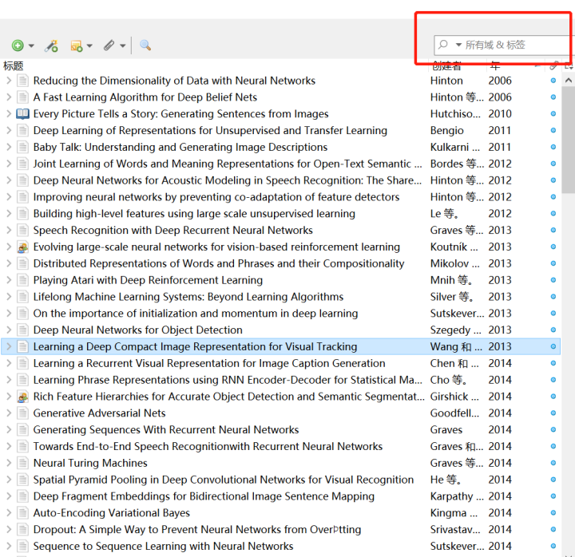
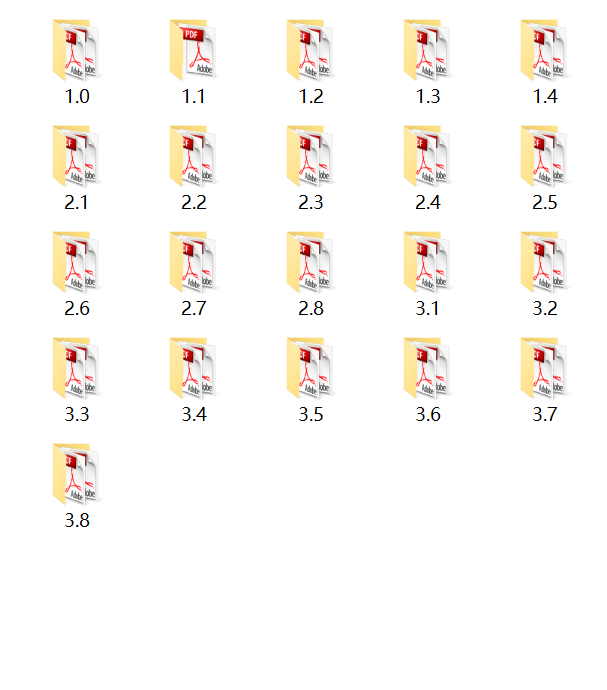

# 深度学习论文阅读路线图
## 0.导语
>作者：Floodsung
>
>出处：https://github.com/floodsung/Deep-Learning-Papers-Reading-Roadmap
>
>翻译：黄海广

如果您是深度学习领域的新手，那么您可能会遇到的第一个问题是“我应该从哪篇论文开始阅读？”

本文是深度学习论文的阅读路线图！

该路线图是根据以下四个准则构建的：

- 从轮廓到细节
- 从旧到最新
- 从通用到特定领域
- 专注于最新技术

您会发现许多非常新的论文，但确实值得阅读。

此外，作者将继续在此路线图中添加论文。

**译者注：**

总共127篇论文，我已经将论文打包。

我已经将论文全部下载了，放到百度云提供下载。

百度云地址：

链接：https://pan.baidu.com/s/17Xcg6-mzRjlNKEIj2lSPiw

提取码：fnks

我将本文的所有论文放在我的数据科学的github中：

 https://github.com/fengdu78/Data-Science-Notes/tree/master/8.deep-learning/Deep-Learning-Papers-Reading-Roadmap 

论文我做成了zotero格式，可以直接在zotero中导入，如果没有安装zotero，那么也可以下载分类好的pdf文件，按照本文论文目录进行分类了。

使用方法：

1.zotero 中阅读，先导入到zotero，阅读论文只需要在红框中输入论文名称即可搜到。

2.直接下载文件阅读

[toc]

## 论文目录

### 1 深度学习的历史和基础

#### 1.0 图书

[0] Bengio, Yoshua, Ian J. Goodfellow, and Aaron Courville. "Deep learning." An MIT Press book. (2015). [html] (Deep Learning Bible, you can read this book while reading following papers.) ⭐️⭐️⭐️⭐️⭐️

#### 1.1 回顾

[1] LeCun, Yann, Yoshua Bengio, and Geoffrey Hinton. "Deep learning." Nature 521.7553 (2015): 436-444. [pdf] (Three Giants' Survey) ⭐️⭐️⭐️⭐️⭐️

#### 1.2 深度信念网络（DBN）（深度学习前夜的里程碑）

[2] Hinton, Geoffrey E., Simon Osindero, and Yee-Whye Teh. "A fast learning algorithm for deep belief nets." Neural computation 18.7 (2006): 1527-1554. [pdf](Deep Learning Eve) ⭐️⭐️⭐️

[3] Hinton, Geoffrey E., and Ruslan R. Salakhutdinov. "Reducing the dimensionality of data with neural networks." Science 313.5786 (2006): 504-507. [pdf] (Milestone, Show the promise of deep learning) ⭐️⭐️⭐️

#### 1.3 ImageNet的发展（深度学习从这里爆发）

[4] Krizhevsky, Alex, Ilya Sutskever, and Geoffrey E. Hinton. "Imagenet classification with deep convolutional neural networks." Advances in neural information processing systems. 2012. [pdf] (AlexNet, Deep Learning Breakthrough) ⭐️⭐️⭐️⭐️⭐️

[5] Simonyan, Karen, and Andrew Zisserman. "Very deep convolutional networks for large-scale image recognition." arXiv preprint arXiv:1409.1556 (2014). [pdf] (VGGNet,Neural Networks become very deep!) ⭐️⭐️⭐️

[6] Szegedy, Christian, et al. "Going deeper with convolutions." Proceedings of the IEEE Conference on Computer Vision and Pattern Recognition. 2015. [pdf] (GoogLeNet) ⭐️⭐️⭐️

[7] He, Kaiming, et al. "Deep residual learning for image recognition." arXiv preprint arXiv:1512.03385 (2015). [pdf] (ResNet,Very very deep networks, CVPR best paper) ⭐️⭐️⭐️⭐️⭐️

#### 1.4 语音识别的发展

[8] Hinton, Geoffrey, et al. "Deep neural networks for acoustic modeling in speech recognition: The shared views of four research groups." IEEE Signal Processing Magazine 29.6 (2012): 82-97. [pdf] (Breakthrough in speech recognition)⭐️⭐️⭐️⭐️

[9] Graves, Alex, Abdel-rahman Mohamed, and Geoffrey Hinton. "Speech recognition with deep recurrent neural networks." 2013 IEEE international conference on acoustics, speech and signal processing. IEEE, 2013. [pdf] (RNN)⭐️⭐️⭐️

[10] Graves, Alex, and Navdeep Jaitly. "Towards End-To-End Speech Recognition with Recurrent Neural Networks." ICML. Vol. 14. 2014. [pdf]⭐️⭐️⭐️

[11] Sak, Haşim, et al. "Fast and accurate recurrent neural network acoustic models for speech recognition." arXiv preprint arXiv:1507.06947 (2015). [pdf] (Google Speech Recognition System) ⭐️⭐️⭐️

[12] Amodei, Dario, et al. "Deep speech 2: End-to-end speech recognition in english and mandarin." arXiv preprint arXiv:1512.02595 (2015). [pdf] (Baidu Speech Recognition System) ⭐️⭐️⭐️⭐️

[13] W. Xiong, J. Droppo, X. Huang, F. Seide, M. Seltzer, A. Stolcke, D. Yu, G. Zweig "Achieving Human Parity in Conversational Speech Recognition." arXiv preprint arXiv:1610.05256 (2016). [pdf] (State-of-the-art in speech recognition, Microsoft) ⭐️⭐️⭐️⭐️

阅读以上论文后，您将对深度学习的历史，深度学习模型的基本架构（包括CNN，RNN，LSTM）以及如何将深度学习应用于图像和语音识别问题有基本的了解。 以下论文将带您深入了解深度学习方法，不同应用领域和领域的深度学习。 我建议您根据自己的兴趣和研究方向选择以下论文。

### 2 深度学习方法

#### 2.1 深度学习模型

[14] Hinton, Geoffrey E., et al. "Improving neural networks by preventing co-adaptation of feature detectors." arXiv preprint arXiv:1207.0580 (2012). [pdf] (Dropout) ⭐️⭐️⭐️

[15] Srivastava, Nitish, et al. "Dropout: a simple way to prevent neural networks from overfitting." Journal of Machine Learning Research 15.1 (2014): 1929-1958. [pdf] ⭐️⭐️⭐️

[16] Ioffe, Sergey, and Christian Szegedy. "Batch normalization: Accelerating deep network training by reducing internal covariate shift." arXiv preprint arXiv:1502.03167 (2015). [pdf] (An outstanding Work in 2015) ⭐️⭐️⭐️⭐️

[17] Ba, Jimmy Lei, Jamie Ryan Kiros, and Geoffrey E. Hinton. "Layer normalization." arXiv preprint arXiv:1607.06450 (2016). [pdf] (Update of Batch Normalization) ⭐️⭐️⭐️⭐️

[18] Courbariaux, Matthieu, et al. "Binarized Neural Networks: Training Neural Networks with Weights and Activations Constrained to+ 1 or−1." [pdf] (New Model,Fast)  ⭐️⭐️⭐️

[19] Jaderberg, Max, et al. "Decoupled neural interfaces using synthetic gradients." arXiv preprint arXiv:1608.05343 (2016). [pdf] (Innovation of Training Method,Amazing Work) ⭐️⭐️⭐️⭐️⭐️

[20] Chen, Tianqi, Ian Goodfellow, and Jonathon Shlens. "Net2net: Accelerating learning via knowledge transfer." arXiv preprint arXiv:1511.05641 (2015). [pdf] (Modify previously trained network to reduce training epochs) ⭐️⭐️⭐️

[21] Wei, Tao, et al. "Network Morphism." arXiv preprint arXiv:1603.01670 (2016). [pdf] (Modify previously trained network to reduce training epochs) ⭐️⭐️⭐️

#### 2.2 优化方法

[22] Sutskever, Ilya, et al. "On the importance of initialization and momentum in deep learning." ICML (3) 28 (2013): 1139-1147. [pdf] (Momentum optimizer) ⭐️⭐️

[23] Kingma, Diederik, and Jimmy Ba. "Adam: A method for stochastic optimization." arXiv preprint arXiv:1412.6980 (2014). [pdf] (Maybe used most often currently) ⭐️⭐️⭐️

[24] Andrychowicz, Marcin, et al. "Learning to learn by gradient descent by gradient descent." arXiv preprint arXiv:1606.04474 (2016). [pdf] (Neural Optimizer,Amazing Work) ⭐️⭐️⭐️⭐️⭐️

[25] Han, Song, Huizi Mao, and William J. Dally. "Deep compression: Compressing deep neural network with pruning, trained quantization and huffman coding." CoRR, abs/1510.00149 2 (2015). [pdf] (ICLR best paper, new direction to make NN running fast,DeePhi Tech Startup) ⭐️⭐️⭐️⭐️⭐️

[26] Iandola, Forrest N., et al. "SqueezeNet: AlexNet-level accuracy with 50x fewer parameters and< 1MB model size." arXiv preprint arXiv:1602.07360 (2016). [pdf] (Also a new direction to optimize NN,DeePhi Tech Startup) ⭐️⭐️⭐️⭐️

#### 2.3 无监督学习/ 深度生成模型

[27] Le, Quoc V. "Building high-level features using large scale unsupervised learning." 2013 IEEE international conference on acoustics, speech and signal processing. IEEE, 2013. [pdf] (Milestone, Andrew Ng, Google Brain Project, Cat) ⭐️⭐️⭐️⭐️

[28] Kingma, Diederik P., and Max Welling. "Auto-encoding variational bayes." arXiv preprint arXiv:1312.6114 (2013). [pdf] (VAE) ⭐️⭐️⭐️⭐️

[29] Goodfellow, Ian, et al. "Generative adversarial nets." Advances in Neural Information Processing Systems. 2014. [pdf] (GAN,super cool idea) ⭐️⭐️⭐️⭐️⭐️

[30] Radford, Alec, Luke Metz, and Soumith Chintala. "Unsupervised representation learning with deep convolutional generative adversarial networks." arXiv preprint arXiv:1511.06434 (2015). [pdf] (DCGAN) ⭐️⭐️⭐️⭐️

[31] Gregor, Karol, et al. "DRAW: A recurrent neural network for image generation." arXiv preprint arXiv:1502.04623 (2015). [pdf] (VAE with attention, outstanding work) ⭐️⭐️⭐️⭐️⭐️

[32] Oord, Aaron van den, Nal Kalchbrenner, and Koray Kavukcuoglu. "Pixel recurrent neural networks." arXiv preprint arXiv:1601.06759 (2016). [pdf] (PixelRNN) ⭐️⭐️⭐️⭐️

[33] Oord, Aaron van den, et al. "Conditional image generation with PixelCNN decoders." arXiv preprint arXiv:1606.05328 (2016). [pdf] (PixelCNN) ⭐️⭐️⭐️⭐️

#### 2.4 RNN / 序列到序列模型

[34] Graves, Alex. "Generating sequences with recurrent neural networks." arXiv preprint arXiv:1308.0850 (2013). [pdf] (LSTM, very nice generating result, show the power of RNN) ⭐️⭐️⭐️⭐️

[35] Cho, Kyunghyun, et al. "Learning phrase representations using RNN encoder-decoder for statistical machine translation." arXiv preprint arXiv:1406.1078 (2014). [pdf] (First Seq-to-Seq Paper) ⭐️⭐️⭐️⭐️

[36] Sutskever, Ilya, Oriol Vinyals, and Quoc V. Le. "Sequence to sequence learning with neural networks." Advances in neural information processing systems. 2014. [pdf] (Outstanding Work) ⭐️⭐️⭐️⭐️⭐️

[37] Bahdanau, Dzmitry, KyungHyun Cho, and Yoshua Bengio. "Neural Machine Translation by Jointly Learning to Align and Translate." arXiv preprint arXiv:1409.0473 (2014). [pdf] ⭐️⭐️⭐️⭐️

[38] Vinyals, Oriol, and Quoc Le. "A neural conversational model." arXiv preprint arXiv:1506.05869 (2015). [pdf] (Seq-to-Seq on Chatbot) ⭐️⭐️⭐️

#### 2.5 神经图灵机

[39] Graves, Alex, Greg Wayne, and Ivo Danihelka. "Neural turing machines." arXiv preprint arXiv:1410.5401 (2014). [pdf] (Basic Prototype of Future Computer) ⭐️⭐️⭐️⭐️⭐️

[40] Zaremba, Wojciech, and Ilya Sutskever. "Reinforcement learning neural Turing machines." arXiv preprint arXiv:1505.00521 362 (2015). [pdf] ⭐️⭐️⭐️

[41] Weston, Jason, Sumit Chopra, and Antoine Bordes. "Memory networks." arXiv preprint arXiv:1410.3916 (2014). [pdf] ⭐️⭐️⭐️

[42] Sukhbaatar, Sainbayar, Jason Weston, and Rob Fergus. "End-to-end memory networks." Advances in neural information processing systems. 2015. [pdf] ⭐️⭐️⭐️⭐️

[43] Vinyals, Oriol, Meire Fortunato, and Navdeep Jaitly. "Pointer networks." Advances in Neural Information Processing Systems. 2015. [pdf] ⭐️⭐️⭐️⭐️

[44] Graves, Alex, et al. "Hybrid computing using a neural network with dynamic external memory." Nature (2016). [pdf] (Milestone,combine above papers' ideas) ⭐️⭐️⭐️⭐️⭐️

#### 2.6 深度强化学习

[45] Mnih, Volodymyr, et al. "Playing atari with deep reinforcement learning." arXiv preprint arXiv:1312.5602 (2013). [pdf]) (First Paper named deep reinforcement learning) ⭐️⭐️⭐️⭐️

[46] Mnih, Volodymyr, et al. "Human-level control through deep reinforcement learning." Nature 518.7540 (2015): 529-533. [pdf] (Milestone) ⭐️⭐️⭐️⭐️⭐️

[47] Wang, Ziyu, Nando de Freitas, and Marc Lanctot. "Dueling network architectures for deep reinforcement learning." arXiv preprint arXiv:1511.06581 (2015). [pdf] (ICLR best paper,great idea)  ⭐️⭐️⭐️⭐️

[48] Mnih, Volodymyr, et al. "Asynchronous methods for deep reinforcement learning." arXiv preprint arXiv:1602.01783 (2016). [pdf] (State-of-the-art method) ⭐️⭐️⭐️⭐️⭐️

[49] Lillicrap, Timothy P., et al. "Continuous control with deep reinforcement learning." arXiv preprint arXiv:1509.02971 (2015). [pdf] (DDPG) ⭐️⭐️⭐️⭐️

[50] Gu, Shixiang, et al. "Continuous Deep Q-Learning with Model-based Acceleration." arXiv preprint arXiv:1603.00748 (2016). [pdf] (NAF) ⭐️⭐️⭐️⭐️

[51] Schulman, John, et al. "Trust region policy optimization." CoRR, abs/1502.05477 (2015). [pdf] (TRPO) ⭐️⭐️⭐️⭐️

[52] Silver, David, et al. "Mastering the game of Go with deep neural networks and tree search." Nature 529.7587 (2016): 484-489. [pdf] (AlphaGo) ⭐️⭐️⭐️⭐️⭐️

#### 2.7 深度迁移学习/终身学习/特别是针对强化学习

[53] Bengio, Yoshua. "Deep Learning of Representations for Unsupervised and Transfer Learning." ICML Unsupervised and Transfer Learning 27 (2012): 17-36. [pdf] (A Tutorial) ⭐️⭐️⭐️

[54] Silver, Daniel L., Qiang Yang, and Lianghao Li. "Lifelong Machine Learning Systems: Beyond Learning Algorithms." AAAI Spring Symposium: Lifelong Machine Learning. 2013. [pdf] (A brief discussion about lifelong learning)  ⭐️⭐️⭐️

[55] Hinton, Geoffrey, Oriol Vinyals, and Jeff Dean. "Distilling the knowledge in a neural network." arXiv preprint arXiv:1503.02531 (2015). [pdf] (Godfather's Work) ⭐️⭐️⭐️⭐️

[56] Rusu, Andrei A., et al. "Policy distillation." arXiv preprint arXiv:1511.06295 (2015). [pdf] (RL domain) ⭐️⭐️⭐️

[57] Parisotto, Emilio, Jimmy Lei Ba, and Ruslan Salakhutdinov. "Actor-mimic: Deep multitask and transfer reinforcement learning." arXiv preprint arXiv:1511.06342 (2015). [pdf] (RL domain) ⭐️⭐️⭐️

[58] Rusu, Andrei A., et al. "Progressive neural networks." arXiv preprint arXiv:1606.04671 (2016). [pdf] (Outstanding Work, A novel idea) ⭐️⭐️⭐️⭐️⭐️

#### 2.8 One-Shot深度学习

[59] Lake, Brenden M., Ruslan Salakhutdinov, and Joshua B. Tenenbaum. "Human-level concept learning through probabilistic program induction." Science 350.6266 (2015): 1332-1338. [pdf] (No Deep Learning,but worth reading) ⭐️⭐️⭐️⭐️⭐️

[60] Koch, Gregory, Richard Zemel, and Ruslan Salakhutdinov. "Siamese Neural Networks for One-shot Image Recognition."(2015) [pdf] ⭐️⭐️⭐️

[61] Santoro, Adam, et al. "One-shot Learning with Memory-Augmented Neural Networks." arXiv preprint arXiv:1605.06065 (2016). [pdf] (A basic step to one shot learning) ⭐️⭐️⭐️⭐️

[62] Vinyals, Oriol, et al. "Matching Networks for One Shot Learning." arXiv preprint arXiv:1606.04080 (2016). [pdf] ⭐️⭐️⭐️

[63] Hariharan, Bharath, and Ross Girshick. "Low-shot visual object recognition." arXiv preprint arXiv:1606.02819 (2016). [pdf] (A step to large data) ⭐️⭐️⭐️⭐️

### 3 应用

#### 3.1 NLP(自然语言处理)

[1] Antoine Bordes, et al. "Joint Learning of Words and Meaning Representations for Open-Text Semantic Parsing." AISTATS(2012) [pdf] ⭐️⭐️⭐️⭐️

[2] Mikolov, et al. "Distributed representations of words and phrases and their compositionality." ANIPS(2013): 3111-3119 [pdf] (word2vec) ⭐️⭐️⭐️

[3] Sutskever, et al. "“Sequence to sequence learning with neural networks." ANIPS(2014) [pdf] ⭐️⭐️⭐️

[4] Ankit Kumar, et al. "“Ask Me Anything: Dynamic Memory Networks for Natural Language Processing." arXiv preprint arXiv:1506.07285(2015) [pdf] ⭐️⭐️⭐️⭐️

[5] Yoon Kim, et al. "Character-Aware Neural Language Models." NIPS(2015) arXiv preprint arXiv:1508.06615(2015) [pdf] ⭐️⭐️⭐️⭐️

[6] Jason Weston, et al. "Towards AI-Complete Question Answering: A Set of Prerequisite Toy Tasks." arXiv preprint arXiv:1502.05698(2015) [pdf] (bAbI tasks) ⭐️⭐️⭐️

[7] Karl Moritz Hermann, et al. "Teaching Machines to Read and Comprehend." arXiv preprint arXiv:1506.03340(2015) [pdf] (CNN/DailyMail cloze style questions) ⭐️⭐️

[8] Alexis Conneau, et al. "Very Deep Convolutional Networks for Natural Language Processing." arXiv preprint arXiv:1606.01781(2016) [pdf] (state-of-the-art in text classification) ⭐️⭐️⭐️

[9] Armand Joulin, et al. "Bag of Tricks for Efficient Text Classification." arXiv preprint arXiv:1607.01759(2016) [pdf] (slightly worse than state-of-the-art, but a lot faster) ⭐️⭐️⭐️

#### 3.2 目标检测

[1] Szegedy, Christian, Alexander Toshev, and Dumitru Erhan. "Deep neural networks for object detection." Advances in Neural Information Processing Systems. 2013. [pdf] ⭐️⭐️⭐️

[2] Girshick, Ross, et al. "Rich feature hierarchies for accurate object detection and semantic segmentation." Proceedings of the IEEE conference on computer vision and pattern recognition. 2014. [pdf] (RCNN) ⭐️⭐️⭐️⭐️⭐️

[3] He, Kaiming, et al. "Spatial pyramid pooling in deep convolutional networks for visual recognition." European Conference on Computer Vision. Springer International Publishing, 2014. [pdf] (SPPNet) ⭐️⭐️⭐️⭐️

[4] Girshick, Ross. "Fast r-cnn." Proceedings of the IEEE International Conference on Computer Vision. 2015. [pdf] ⭐️⭐️⭐️⭐️

[5] Ren, Shaoqing, et al. "Faster R-CNN: Towards real-time object detection with region proposal networks." Advances in neural information processing systems. 2015. [pdf] ⭐️⭐️⭐️⭐️

[6] Redmon, Joseph, et al. "You only look once: Unified, real-time object detection." arXiv preprint arXiv:1506.02640 (2015). [pdf] (YOLO,Oustanding Work, really practical) ⭐️⭐️⭐️⭐️⭐️

[7] Liu, Wei, et al. "SSD: Single Shot MultiBox Detector." arXiv preprint arXiv:1512.02325 (2015). [pdf] ⭐️⭐️⭐️

[8] Dai, Jifeng, et al. "R-FCN: Object Detection via
Region-based Fully Convolutional Networks." arXiv preprint arXiv:1605.06409 (2016). [pdf] ⭐️⭐️⭐️⭐️

[9] He, Gkioxari, et al. "Mask R-CNN" arXiv preprint arXiv:1703.06870 (2017). [pdf] ⭐️⭐️⭐️⭐️

#### 3.3 目标跟踪

[1] Wang, Naiyan, and Dit-Yan Yeung. "Learning a deep compact image representation for visual tracking." Advances in neural information processing systems. 2013. [pdf] (First Paper to do visual tracking using Deep Learning,DLT Tracker) ⭐️⭐️⭐️

[2] Wang, Naiyan, et al. "Transferring rich feature hierarchies for robust visual tracking." arXiv preprint arXiv:1501.04587 (2015). [pdf] (SO-DLT) ⭐️⭐️⭐️⭐️

[3] Wang, Lijun, et al. "Visual tracking with fully convolutional networks." Proceedings of the IEEE International Conference on Computer Vision. 2015. [pdf] (FCNT) ⭐️⭐️⭐️⭐️

[4] Held, David, Sebastian Thrun, and Silvio Savarese. "Learning to Track at 100 FPS with Deep Regression Networks." arXiv preprint arXiv:1604.01802 (2016). [pdf] (GOTURN,Really fast as a deep learning method,but still far behind un-deep-learning methods) ⭐️⭐️⭐️⭐️

[5] Bertinetto, Luca, et al. "Fully-Convolutional Siamese Networks for Object Tracking." arXiv preprint arXiv:1606.09549 (2016). [pdf] (SiameseFC,New state-of-the-art for real-time object tracking) ⭐️⭐️⭐️⭐️

[6] Martin Danelljan, Andreas Robinson, Fahad Khan, Michael Felsberg. "Beyond Correlation Filters: Learning Continuous Convolution Operators for Visual Tracking." ECCV (2016) [pdf] (C-COT) ⭐️⭐️⭐️⭐️

[7] Nam, Hyeonseob, Mooyeol Baek, and Bohyung Han. "Modeling and Propagating CNNs in a Tree Structure for Visual Tracking." arXiv preprint arXiv:1608.07242 (2016). [pdf] (VOT2016 Winner,TCNN) ⭐️⭐️⭐️⭐️

#### 3.4 图像标注

[1] Farhadi,Ali,etal. "Every picture tells a story: Generating sentences from images". In Computer VisionECCV 2010. Springer Berlin Heidelberg:15-29, 2010. [pdf] ⭐️⭐️⭐️

[2] Kulkarni, Girish, et al. "Baby talk: Understanding and generating image descriptions". In Proceedings of the 24th CVPR, 2011. [pdf]⭐️⭐️⭐️⭐️

[3] Vinyals, Oriol, et al. "Show and tell: A neural image caption generator". In arXiv preprint arXiv:1411.4555, 2014. [pdf]⭐️⭐️⭐️

[4] Donahue, Jeff, et al. "Long-term recurrent convolutional networks for visual recognition and description". In arXiv preprint arXiv:1411.4389 ,2014. [pdf]

[5] Karpathy, Andrej, and Li Fei-Fei. "Deep visual-semantic alignments for generating image descriptions". In arXiv preprint arXiv:1412.2306, 2014. [pdf]⭐️⭐️⭐️⭐️⭐️

[6] Karpathy, Andrej, Armand Joulin, and Fei Fei F. Li. "Deep fragment embeddings for bidirectional image sentence mapping". In Advances in neural information processing systems, 2014. [pdf]⭐️⭐️⭐️⭐️

[7] Fang, Hao, et al. "From captions to visual concepts and back". In arXiv preprint arXiv:1411.4952, 2014. [pdf]⭐️⭐️⭐️⭐️⭐️

[8] Chen, Xinlei, and C. Lawrence Zitnick. "Learning a recurrent visual representation for image caption generation". In arXiv preprint arXiv:1411.5654, 2014. [pdf]⭐️⭐️⭐️⭐️

[9] Mao, Junhua, et al. "Deep captioning with multimodal recurrent neural networks (m-rnn)". In arXiv preprint arXiv:1412.6632, 2014. [pdf]⭐️⭐️⭐️

[10] Xu, Kelvin, et al. "Show, attend and tell: Neural image caption generation with visual attention". In arXiv preprint arXiv:1502.03044, 2015. [pdf]⭐️⭐️⭐️⭐️⭐️

#### 3.5 机器翻译

Some milestone papers are listed in RNN / Seq-to-Seq topic.

[1] Luong, Minh-Thang, et al. "Addressing the rare word problem in neural machine translation." arXiv preprint arXiv:1410.8206 (2014). [pdf] ⭐️⭐️⭐️⭐️

[2] Sennrich, et al. "Neural Machine Translation of Rare Words with Subword Units". In arXiv preprint arXiv:1508.07909, 2015. [pdf]⭐️⭐️⭐️

[3] Luong, Minh-Thang, Hieu Pham, and Christopher D. Manning. "Effective approaches to attention-based neural machine translation." arXiv preprint arXiv:1508.04025 (2015). [pdf] ⭐️⭐️⭐️⭐️

[4] Chung, et al. "A Character-Level Decoder without Explicit Segmentation for Neural Machine Translation". In arXiv preprint arXiv:1603.06147, 2016. [pdf]⭐️⭐️

[5] Lee, et al. "Fully Character-Level Neural Machine Translation without Explicit Segmentation". In arXiv preprint arXiv:1610.03017, 2016. [pdf]⭐️⭐️⭐️⭐️⭐️

[6] Wu, Schuster, Chen, Le, et al. "Google's Neural Machine Translation System: Bridging the Gap between Human and Machine Translation". In arXiv preprint arXiv:1609.08144v2, 2016. [pdf] (Milestone) ⭐️⭐️⭐️⭐️

#### 3.6 机器人

[1] Koutník, Jan, et al. "Evolving large-scale neural networks for vision-based reinforcement learning." Proceedings of the 15th annual conference on Genetic and evolutionary computation. ACM, 2013. [pdf] ⭐️⭐️⭐️

[2] Levine, Sergey, et al. "End-to-end training of deep visuomotor policies." Journal of Machine Learning Research 17.39 (2016): 1-40. [pdf] ⭐️⭐️⭐️⭐️⭐️

[3] Pinto, Lerrel, and Abhinav Gupta. "Supersizing self-supervision: Learning to grasp from 50k tries and 700 robot hours." arXiv preprint arXiv:1509.06825 (2015). [pdf] ⭐️⭐️⭐️

[4] Levine, Sergey, et al. "Learning Hand-Eye Coordination for Robotic Grasping with Deep Learning and Large-Scale Data Collection." arXiv preprint arXiv:1603.02199 (2016). [pdf] ⭐️⭐️⭐️⭐️

[5] Zhu, Yuke, et al. "Target-driven Visual Navigation in Indoor Scenes using Deep Reinforcement Learning." arXiv preprint arXiv:1609.05143 (2016). [pdf] ⭐️⭐️⭐️⭐️

[6] Yahya, Ali, et al. "Collective Robot Reinforcement Learning with Distributed Asynchronous Guided Policy Search." arXiv preprint arXiv:1610.00673 (2016). [pdf] ⭐️⭐️⭐️⭐️

[7] Gu, Shixiang, et al. "Deep Reinforcement Learning for Robotic Manipulation." arXiv preprint arXiv:1610.00633 (2016). [pdf] ⭐️⭐️⭐️⭐️

[8] A Rusu, M Vecerik, Thomas Rothörl, N Heess, R Pascanu, R Hadsell."Sim-to-Real Robot Learning from Pixels with Progressive Nets." arXiv preprint arXiv:1610.04286 (2016). [pdf] ⭐️⭐️⭐️⭐️

[9] Mirowski, Piotr, et al. "Learning to navigate in complex environments." arXiv preprint arXiv:1611.03673 (2016). [pdf] ⭐️⭐️⭐️⭐️

#### 3.7 Art

[1] Mordvintsev, Alexander; Olah, Christopher; Tyka, Mike (2015). "Inceptionism: Going Deeper into Neural Networks". Google Research. [html] (Deep Dream)
⭐️⭐️⭐️⭐️

[2] Gatys, Leon A., Alexander S. Ecker, and Matthias Bethge. "A neural algorithm of artistic style." arXiv preprint arXiv:1508.06576 (2015). [pdf] (Outstanding Work, most successful method currently) ⭐️⭐️⭐️⭐️⭐️

[3] Zhu, Jun-Yan, et al. "Generative Visual Manipulation on the Natural Image Manifold." European Conference on Computer Vision. Springer International Publishing, 2016. [pdf] (iGAN) ⭐️⭐️⭐️⭐️

[4] Champandard, Alex J. "Semantic Style Transfer and Turning Two-Bit Doodles into Fine Artworks." arXiv preprint arXiv:1603.01768 (2016). [pdf] (Neural Doodle) ⭐️⭐️⭐️⭐️

[5] Zhang, Richard, Phillip Isola, and Alexei A. Efros. "Colorful Image Colorization." arXiv preprint arXiv:1603.08511 (2016). [pdf] ⭐️⭐️⭐️⭐️

[6] Johnson, Justin, Alexandre Alahi, and Li Fei-Fei. "Perceptual losses for real-time style transfer and super-resolution." arXiv preprint arXiv:1603.08155 (2016). [pdf] ⭐️⭐️⭐️⭐️

[7] Vincent Dumoulin, Jonathon Shlens and Manjunath Kudlur. "A learned representation for artistic style." arXiv preprint arXiv:1610.07629 (2016). [pdf] ⭐️⭐️⭐️⭐️

[8] Gatys, Leon and Ecker, et al."Controlling Perceptual Factors in Neural Style Transfer." arXiv preprint arXiv:1611.07865 (2016). [pdf] (control style transfer over spatial location,colour information and across spatial scale)⭐️⭐️⭐️⭐️

[9] Ulyanov, Dmitry and Lebedev, Vadim, et al. "Texture Networks: Feed-forward Synthesis of Textures and Stylized Images." arXiv preprint arXiv:1603.03417(2016). [pdf] (texture generation and style transfer) ⭐️⭐️⭐️⭐️

#### 3.8 目标分割

[1] J. Long, E. Shelhamer, and T. Darrell, “Fully convolutional networks for semantic segmentation.” in CVPR, 2015. [pdf] ⭐️⭐️⭐️⭐️⭐️

[2] L.-C. Chen, G. Papandreou, I. Kokkinos, K. Murphy, and A. L. Yuille. "Semantic image segmentation with deep convolutional nets and fully connected crfs." In ICLR, 2015. [pdf] ⭐️⭐️⭐️⭐️⭐️

[3] Pinheiro, P.O., Collobert, R., Dollar, P. "Learning to segment object candidates." In: NIPS. 2015. [pdf] ⭐️⭐️⭐️⭐️

[4] Dai, J., He, K., Sun, J. "Instance-aware semantic segmentation via multi-task network cascades." in CVPR. 2016 [pdf] ⭐️⭐️⭐️

[5] Dai, J., He, K., Sun, J. "Instance-sensitive Fully Convolutional Networks." arXiv preprint arXiv:1603.08678 (2016). [pdf] ⭐️⭐️⭐️

## 论文下载

百度云地址发布：

链接：https://pan.baidu.com/s/17Xcg6-mzRjlNKEIj2lSPiw

提取码：fnks